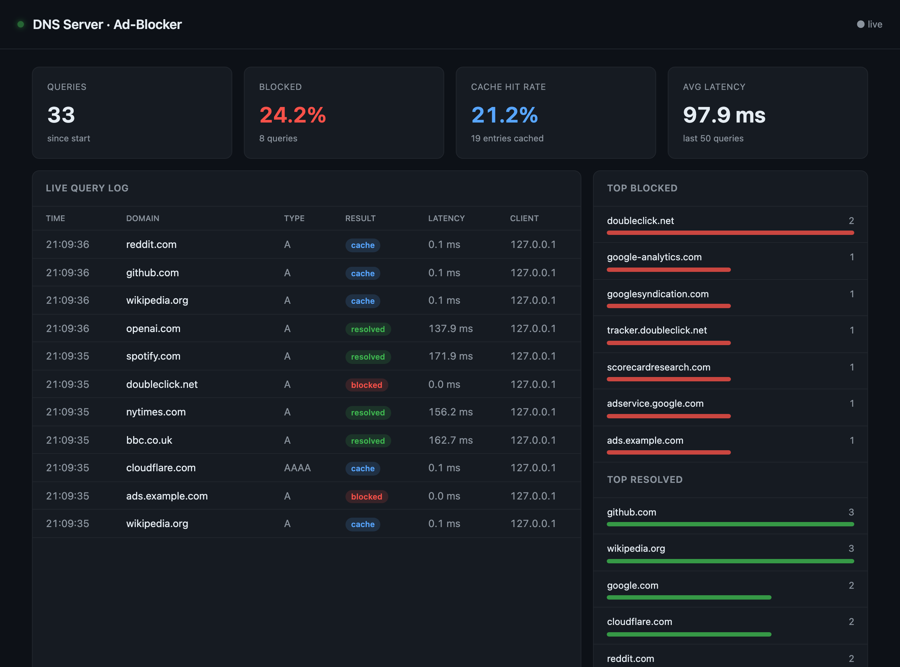

# Pi-hole-lite — a DNS server + ad-blocker, from scratch in Python

[](https://github.com/shaqa3/pihole-lite/actions/workflows/ci.yml)
[](https://www.python.org/)
[](LICENSE)

A real DNS server you can point a machine at. It parses the binary **DNS wire
protocol** by hand, resolves names **recursively from the root servers**, caches
answers by **TTL**, and filters queries against a **blocklist** so ad/tracker
domains resolve to nothing. A live **dashboard** shows every query, what was
blocked, and the cache hit rate in real time.

**Zero dependencies** — everything runs on the Python standard library
(`asyncio`, `socket`, `struct`). Requires Python 3.11+. `dig` is handy for
testing; Docker is optional.

```
┌──────────┐   UDP/TCP :53    ┌───────────────────────────────────────────┐
│  client  │ ───────────────► │  BlockingResolver                         │
│  (dig,   │                  │    └─ RecursiveResolver ─┐  (or Forwarding)│
│  your OS)│ ◄─────────────── │         └─ Cache ────────┘                 │
└──────────┘                  │  every query → Stats ─► SSE ─► Dashboard   │
                              └───────────────────────────────────────────┘
                                                          http://…:8053
```

---

## Screenshots

The live dashboard — real query stream, blocked %, cache hit rate, and top
domains, all updating over Server-Sent Events as queries arrive:



<sub>A real headless-Chromium capture of the running dashboard. Resolved names
walk root→authoritative (~150 ms), cache hits return in ~0.1 ms, and ad/tracker
domains are blocked in ~0 ms before any network I/O. Regenerate it any time with
<code>python scripts/screenshot.py</code> (see
<a href="requirements-dev.txt">requirements-dev.txt</a>).</sub>

---

## Quick start

Fastest path — the helper scripts start the server + dashboard and open it:

```bash
./start.sh            # boots the resolver + dashboard, opens http://127.0.0.1:8053
DEMO=1 ./start.sh     # ...and streams demo traffic so the dashboard is lively
./stop.sh             # stop it (frees the ports)
```

In **VS Code**, the same actions are one click away: install the recommended
`actboy168.tasks` extension and use the **DNS Start / Traffic / Stop** buttons in
the status bar (or Run Task, or ⇧⌘B to start). Start, then click **Traffic** to
stream demo lookups into the live dashboard. See [`.vscode/tasks.json`](.vscode/tasks.json).

Or run the module directly for full control:

```bash
# Recursive-from-root resolver + ad-blocking + dashboard (dev ports, no root):
python -m dns_server.main \
    --port 15353 --web-port 8053 \
    --blocklist blocklists/sample.txt

# In another terminal — query it:
dig @127.0.0.1 -p 15353 example.com          # resolved from the root servers
dig @127.0.0.1 -p 15353 doubleclick.net      # blocked → 0.0.0.0
dig @127.0.0.1 -p 15353 example.com          # again → served from cache (lower TTL)

# Open the dashboard:
open http://127.0.0.1:8053

# ...and feed it a steady stream of realistic traffic to watch:
./demo-traffic.sh
```

**More commands:** see [`CHEATSHEET.md`](CHEATSHEET.md) for a copy-paste
reference — running modes, `dig` recipes, pointing your OS at the resolver,
Docker, and troubleshooting.

Prefer to lean on a fast upstream instead of walking the root yourself?

```bash
python -m dns_server.main --mode forward --upstream 1.1.1.1 \
    --port 15353 --web-port 8053 --blocklist blocklists/sample.txt
```

### Run it for real (port 53)

Port 53 is privileged, so binding it needs root. Point **one machine** at it
first — don't reconfigure your whole LAN until you trust it.

```bash
sudo python -m dns_server.main --host 0.0.0.0 --port 53 --web-port 8053 \
    --blocklist blocklists/sample.txt
# Then set that machine's DNS server to this host's IP.
```

### Docker

```bash
docker compose up --build
# DNS on :53 (UDP+TCP), dashboard on http://localhost:8053
```

---

## The concepts, in depth

### 1. The DNS wire protocol (`wire.py`)

A DNS message — query *or* response — is a compact binary blob with five parts:
a fixed **12-byte header**, then the **question**, **answer**, **authority**,
and **additional** sections. A query fills in the header + question; the server
copies the question back and fills in the rest. Same shape both directions.

The header packs eight flags into a single 16-bit word — `QR` (query/response),
`Opcode`, `AA` (authoritative answer), `TC` (truncated), `RD` (recursion
desired), `RA` (recursion available), and the 4-bit `RCODE` (result). We pack
and unpack those bits by hand in `Header`.

**Names are the interesting part.** A domain isn't a string — it's a sequence of
length-prefixed labels ending in a zero byte:

```
www.example.com  →  3 'www'  7 'example'  3 'com'  0
```

**The compression trick (RFC 1035 §4.1.4).** Because one response repeats the
same domain many times, DNS compresses names with *pointers*. If a label's
length byte has its top two bits set (`0b11……`), it and the next byte are a
14-bit offset from the **start of the message** — "jump there and keep reading."
This is why you can't parse a record in isolation: a pointer can reference any
earlier byte in the packet. `Reader.read_name` follows pointers (with a loop
guard, since a self-referential pointer is a classic DoS), and `Writer` *emits*
compression by remembering where each name suffix was written.

> A real gotcha this project surfaced: an **EDNS(0) `OPT`** record (which `dig`
> sends by default) reuses the record **CLASS** field to advertise the client's
> UDP buffer size — so a strict `RecordClass(4096)` throws. Robust parsers must
> tolerate it. See `records.py`.

### 2. Recursive vs. iterative resolution (`resolver.py`, `roots.py`)

To resolve `www.example.com` from nothing, you walk **down the delegation tree**:

1. Ask a **root** server. It doesn't know the address, but it knows who runs
   `.com` — it returns a **referral**: `NS` records for the com TLD servers plus
   **glue** (their `A` records) in the additional section.
2. Ask a **`.com`** server → referral to `example.com`'s authoritative servers.
3. Ask an **`example.com`** server → it owns the zone, so it returns the actual
   **answer** with the `AA` bit set.

That downward walk is **iterative** querying; doing it *on behalf of* the client
is being a **recursive** resolver. The root addresses can't themselves be looked
up (chicken-and-egg), so every resolver ships them baked in — our **root hints**
in `roots.py`. The resolver also handles **CNAME chains** (an alias you must
re-resolve), **glueless referrals** (an `NS` whose address you must go resolve
first), and **depth/loop guards** so a hostile zone can't spin you forever.

### 3. Caching, TTLs, and negative caching (`cache.py`)

Every record carries a **TTL** (seconds you may reuse it). Caching turns a
~150 ms walk-from-root into a sub-millisecond memory hit — and spares the root
servers. Two things make a correct cache more than a `dict`:

- **TTL countdown.** A record cached at TTL 300 and served 200 s later must go
  out with TTL ≈ 100. We store an absolute (monotonic) expiry and recompute the
  remaining TTL on every read, evicting at zero.
- **Negative caching (RFC 2308).** "This name doesn't exist" (`NXDOMAIN`) and
  "exists but not this type" (`NODATA`) are worth caching too, or a typo in a
  loop hammers upstream forever. The TTL comes from the `SOA` record's `MINIMUM`
  in the authority section.

You can watch this live: query a name twice and the dashboard shows the second
as a **cache** hit with a lower TTL.

### 4. How DNS ad-blocking works — and its limits (`blocklist.py`)

Your browser can't load an ad it can't find the IP for. Ads/trackers live on
identifiable domains, so if the resolver refuses to answer for them, the request
dies before any ad content is fetched — network-wide, for every device, no
per-app extension. We match **by suffix** (listing `doubleclick.net` blocks
`ad.stats.doubleclick.net` too) and answer either with a **sinkhole**
(`0.0.0.0` / `::`) or **`NXDOMAIN`**.

**Limits worth knowing:** DNS blocking is domain-level and blunt. It **can't**
block first-party ads served from the same domain as content, and it **can't**
see inside HTTPS to filter by URL path. It's a powerful coarse filter, not a
content filter.

### 5. UDP, TCP, truncation & EDNS (`server.py`)

DNS uses **both** transports on port 53. **UDP** is the default (one datagram
each way) but was historically capped at **512 bytes**; if a response is bigger
the server sets **`TC` (truncated)** and the client retries over **TCP**, where
each message is framed with a 2-byte length. **EDNS(0)** lets a client advertise
a larger UDP buffer to avoid that fallback. Our server speaks UDP and TCP, and
performs the truncate-then-retry dance.

---

## Project layout

```
dns_server/
  records.py     constants: record types, classes, opcodes, rcodes
  wire.py        ★ the binary codec: parse/serialise + name compression
  cache.py       TTL cache with negative caching
  roots.py       the 13 root-server hint addresses
  resolver.py    Forwarding, Caching, and Recursive resolvers (composable)
  blocklist.py   blocklist loading + suffix matching + BlockingResolver
  server.py      asyncio UDP+TCP DNS server on :53
  stats.py       per-query event bus + aggregates for the dashboard
  webserver.py   zero-dep asyncio HTTP + Server-Sent-Events server
  main.py        composition root / CLI entrypoint
web/static/index.html   the live dashboard (vanilla JS + EventSource)
blocklists/sample.txt   example blocklist (hosts + domain formats)
tests/                  wire codec, cache, and blocklist tests
```

Query flow (outermost first): `BlockingResolver → RecursiveResolver → Cache`.
Each layer implements the same `handle()` interface, which is why you can swap a
static map for a forwarder for a full recursive resolver without touching the
socket code.

---

## Testing

```bash
# With pytest, if you have it:
pytest -q

# Zero-dependency runner (no pytest needed):
python -c "import sys; sys.path.insert(0,'.'); \
import tests.test_wire as w, tests.test_cache_blocklist as c; \
[getattr(m,n)() for m in (w,c) for n in dir(m) if n.startswith('test_')]; \
print('all tests passed')"
```

The most convincing test, `test_parses_real_response_with_compression`-style
checks aside, is simply pointing `dig` at the running server and watching the
dashboard.

---

## Ideas to extend it

- **DNS-over-HTTPS / DNS-over-TLS** upstream (encrypted resolution).
- Custom local records (be authoritative for your own `*.home` zone) — the
  `StaticResolver` is already the mechanism.
- Per-client rules / allowlists; regex blocklists; scheduled block groups.
- Prometheus metrics + a queries/sec benchmark.
- An LRU bound on the cache and prefetch-on-near-expiry.

---

## License

[MIT](LICENSE) © Shahab Qadeer
